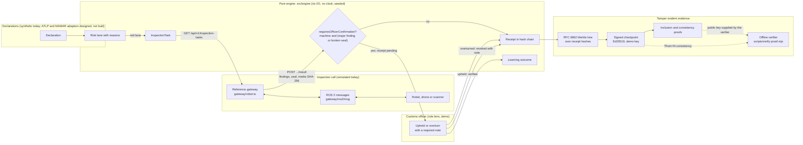

# Architecture and evidence flow

Source: [edge-architecture.mmd](edge-architecture.mmd). This page embeds the same diagram so that it renders on GitHub; a test keeps the two identical.

```mermaid
%% Madoun architecture and evidence flow for the Edge proposal (v1.5.0). Renders on GitHub and in any Mermaid viewer.
%% Solid arrows: data or events. Dotted arrows: verification. Everything runs offline on one host; all data is synthetic.
flowchart LR
  subgraph Sources["Declarations (synthetic today; ATLP and MAMAR adapters designed, not built)"]
    D[Declaration]
  end

  subgraph Engine["Pure engine: src/engine (no I/O, no clock, seeded)"]
    R[Risk lane with reasons]
    T[InspectionTask]
    V{"requiresOfficerConfirmation?<br/>machine and (major finding or broken seal)"}
    RC[Receipt in hash chain]
    L[Learning outcome]
  end

  subgraph Cell["Inspection cell (simulated today)"]
    G["Reference gateway<br/>gateway/robot.ts"]
    ROS["ROS 2 messages<br/>gateway/ros2/msg"]
    RB[Robot, drone or scanner]
  end

  subgraph People["Customs officer (role lens, demo)"]
    O["Uphold or overturn<br/>with a required note"]
  end

  subgraph Evidence["Tamper evident evidence"]
    M["RFC 6962 Merkle tree<br/>over receipt hashes"]
    C["Signed checkpoint<br/>Ed25519, demo key"]
    P[Inclusion and consistency proofs]
    X["Offline verifier<br/>scripts/verify-proof.mjs"]
  end

  D --> R -->|red lane| T
  T -->|GET /api/v1/inspection-tasks| G
  G <--> ROS <--> RB
  G -->|"POST .../result<br/>findings, seal, media SHA-256"| V
  V -->|no| RC
  V -->|"yes: receipt pending"| O
  O -->|upheld: verified| RC
  O -->|overturned: revoked with note| RC
  O --> L
  RC --> M --> C --> P
  P -.->|"public key supplied by the verifier"| X
  C -.->|"?from=N consistency"| X
```
