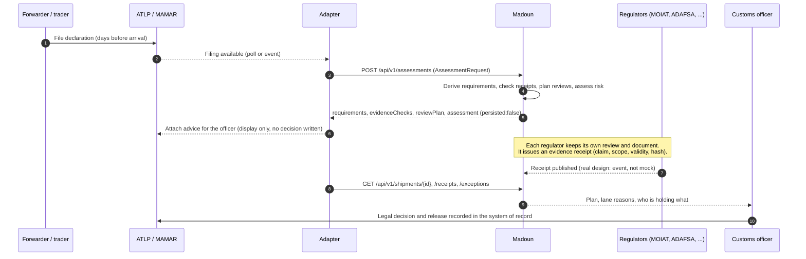

# Integration: how Madoun would sit beside ATLP / MAMAR

> **Everything in this document describes a design plus a mock.** The API under `/api/v1` serves a seeded synthetic dataset, persists nothing and has no authentication. We have not seen ATLP or MAMAR interface specifications; where this document names a capability of those systems it is an assumption to be confirmed, not a fact. Nothing here has been tested against, or approved by, any government system.

The contract is in [`public/openapi.yaml`](../public/openapi.yaml) (OpenAPI 3.1), with JSON Schemas for the two payloads that cross the boundary in [`docs/schemas/`](./schemas/): `assessment-request.schema.json` and `evidence-receipt.schema.json`.

## 1. The adapter pattern

Madoun does not replace the declaration system and does not become a second place to file. A small **adapter**, owned and operated on the declaration system's side of the boundary, translates between that system and Madoun.

```
 ATLP / MAMAR (system of record)          adapter                     Madoun
 ┌──────────────────────────┐   read    ┌───────────┐  POST /assessments  ┌──────────────────┐
 │ declarations, permits,   │ ────────► │ map filing │ ─────────────────► │ requirements,    │
 │ legal decisions, release │           │ to         │ ◄───────────────── │ evidence check,  │
 │                          │           │ Assessment │  plan + lane +      │ review plan,     │
 │ (never written by Madoun)│           │ Request    │  reasons            │ risk assessment  │
 └──────────────────────────┘           └───────────┘                     └──────────────────┘
```

Rules the design holds to:

1. **Read filings, write nothing back to declarations.** Madoun's output is advice (a plan, a recommended lane, reasons). Any lane or release decision stays with the officer and is recorded in the system of record. This is why `POST /assessments` returns `persisted: false` and is the only write-shaped endpoint in the mock.
2. **One mapping, owned by the adapter.** The adapter maps a filing to `AssessmentRequest`. Madoun rejects unknown fields (strict validation, HTTP 422 with `{path, message}` issues) so schema drift is caught at the boundary, not silently absorbed.
3. **Madoun ids are internal.** Madoun generates ids for the shipment, consignments and items. The adapter correlates on `declarationRef`, which Madoun echoes back.
4. **Advice must be explainable.** Every lane and verdict carries reasons (`assessment.reasons`, `evidenceChecks[].reason`) so an officer can see why, in English and Arabic.

## 2. Pre-arrival flow



Steps 3 to 5, and the read calls in steps 8 and 9, are what the mock implements. The receipt publication from regulators (step 7) is **not** in the mock: receipts are pre-generated by the simulator, and there is no endpoint to submit one.

## 3. Data minimisation: receipts, not documents

A receipt (`EvidenceReceipt`) says: *this authority verified this kind of evidence, for this scope, valid between these dates, shareable with these authorities, and here is its place in the hash chain.* It does not carry the certificate, the lab report or the invoice.

- The authority that verified a document remains its custodian. Other authorities rely on the receipt instead of asking the trader for the document again.
- `sharedWith` is the custodian's sharing policy (`all`, or a list of authority ids). The engine honours it when deciding whether a receipt satisfies another authority's requirement (`not-shared` verdict otherwise).
- `scope` limits a receipt to a shipment, trader or trader-product (HS6 prefixes, origins), so a certificate for one product is not stretched to cover another.
- The hash chain (`GET /receipts/verify`) detects after-the-fact edits to the ledger. It proves integrity of the claims Madoun holds, not that the underlying document is genuine.
- `AssessmentRequest` carries goods lines, values and handling flags, which is what risk and requirement logic needs. It carries no document bodies, no personal identity fields, and the mock dataset contains none. A real filing contains more; the adapter should forward only the fields in the schema.

## 4. What is mocked, and what a real integration needs

| Concern | In this mock | A real integration needs |
|---|---|---|
| Data | Seeded synthetic world built once per server process | Real filings and receipts; no synthetic fallback in production |
| Authentication | **None.** `src/server/auth.ts` is a placeholder that allows everything | Mutual TLS between systems, per-client API keys scoped per route, key rotation, rate limits |
| Authorisation | Every caller sees every receipt, ignoring `sharedWith` | Filter all reads by the caller's authority id and the custodian's policy |
| Transport | Plain HTTP route handlers in a Next.js app | Government network gateway, TLS termination, approved hosting and data residency |
| Writes | None; `POST /assessments` computes and discards | Authority-signed receipt submission; officer decisions recorded in the system of record |
| Idempotency | Not needed (nothing persists), no `Idempotency-Key` handling | `Idempotency-Key` on every write, deduplicated per client; stable correlation on `declarationRef` plus a filing version |
| Event ingestion | The adapter must call the API; no webhooks or streams | Filing-created / amended / cancelled events, receipt issued / revoked events, at-least-once delivery with replay |
| Queueing | Synchronous request and response | A queue between adapter and Madoun so ATLP/MAMAR availability does not depend on Madoun, and back-pressure at peak filing times |
| Amendments | A filing is assessed fresh each time; ids are regenerated | Versioned filings, re-assessment on amendment, audit of which version produced which advice |
| Time | The engine never reads the wall clock; assessments are evaluated at the dataset snapshot time (`evaluatedAt`) | Wall-clock time or an explicit `asOf`, with clock-skew rules for validity windows |
| Audit | Synthetic audit trail per shipment | Tamper-evident log of every call (client, route, request id), retention policy |
| Reference data | Invented authorities, requirements and traders (`src/data`) | Official requirement catalogue, HS tariff data, trader registry mapping |
| Performance and availability | Not measured, single process | Load testing against real filing volumes, failure modes when Madoun is down (the adapter must fail open to the existing process) |
| KPIs | `GET /kpis` is the simulator's output, using stated modelling assumptions | Time-release-study style measurement on real data before any claim |
| Learning | Suggestions exist in the UI only; not exposed by this API | Governance for any change to risk weights; human approval stays mandatory |

## 5. Open questions for Abu Dhabi Customs

1. Does ATLP/MAMAR expose filing data to external systems today (API, file exchange, event feed), and in what format? Which fields would the adapter be permitted to read?
2. Who may operate the adapter: Customs, the port community system operator, or Madoun under supervision? Where must it run?
3. How are filings identified and versioned across amendments, so that advice can be tied to a specific version?
4. Which authorities already issue machine-readable verification outcomes, and could they publish receipts (claim, scope, validity) without releasing documents?
5. What legal basis and data-sharing agreements govern one authority relying on another's verification? Can the custodian's `sharedWith` policy be expressed in those terms?
6. What are the security and certification requirements (mTLS, hosting, data residency, penetration testing, audit logging) before any pilot with non-synthetic data?
7. Which of the criteria used in the mock risk logic are acceptable to use for lane advice, and who approves changes to weights?
8. What is the required behaviour when Madoun is unavailable or wrong? (The assumption here: the existing process continues unchanged.)
9. Which time-release measurements does Customs already collect, so a pilot can be evaluated against its own baseline?
10. How should the Arabic and English reasons be reviewed and approved for official use?

## 6. Trying the mock

```bash
npm run dev            # then:
curl localhost:3000/api/v1/health
curl 'localhost:3000/api/v1/shipments?lane=red&pageSize=5'
curl localhost:3000/api/v1/receipts/verify
curl -X POST localhost:3000/api/v1/assessments \
  -H 'content-type: application/json' --data @payload.json   # see the example in openapi.yaml
```

Every response carries `X-Madoun-Synthetic: true` and `Cache-Control: no-store`. Errors always have the shape `{"error":{"code","message","details?"}}`.
